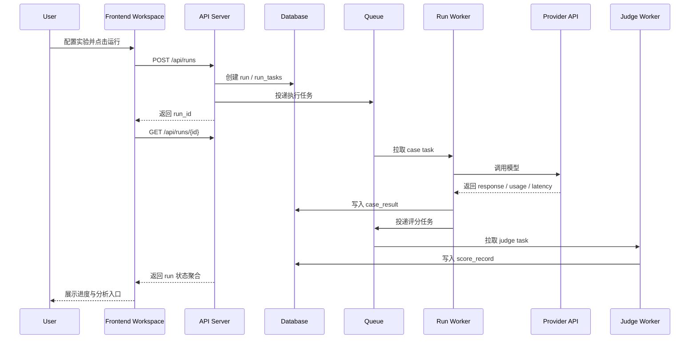

# Model Eval 平台技术方案

## 0. 文档信息
- 版本：v0.1
- 作者：Codex
- 关联文档：`docs/model-eval-prototype-spec.md`
- 评审对象：前端 / 后端 / 算法 / 数据 / 测试 / 运维

## 1. 执行摘要
本方案面向 Model Eval 从“单页多模型对照工具”升级为“模型评测与对比平台”的目标，重点解决四类问题：第一，建立稳定的领域对象体系，包括 Dataset、Experiment、Run、Score Record、Report 等；第二，打通标准批量评测与场景化模拟评测两条链路；第三，让结果具备可回放、可复跑、可比较、可分享的能力；第四，在不过早引入微服务复杂度的前提下，为后续扩展到多 Provider、多评分方式和团队协作提供清晰边界。

推荐的技术路径是：保持单体 Web App + 单体 Backend 的演进路线，但在 Backend 内部按领域模块拆分，并引入异步 Run Worker。相比继续沿用纯前端 + 本地文件模式，这条路径能真正承载 run 生命周期、评分流水线和团队协作；相比一开始拆成多服务，它又更适合当前阶段的人力与迭代效率。场景化评测（如 `zhumengdao`）在 V1 作为同平台下的特殊运行器接入统一资产和统计体系，而不强行与 batch eval 使用完全相同的 UI。

## 2. 目标、范围与假设
### 2.1 目标
- 本方案解决什么问题：建立可扩展的评测平台技术底座，支持标准化 batch eval、主观场景评测、评分中心、结果分析与报告沉淀
- 成功标准：
  - 实验运行结果自动生成 Run 并可回看
  - Dataset / Experiment / Run / Score Record 形成清晰数据关系
  - 支持多模型、多 Provider、按列独立配置
  - 支持规则评分、Judge、人工评分三种评分流水线
  - 标准评测与场景评测都能沉淀统一的统计与报告资产

### 2.2 范围
- 本期包含：
  - Web 前端工作台重构
  - 后端单体服务模块化
  - 数据库建模
  - Run 执行队列与 Worker
  - 标准评测 API、评分 API、分析 API、报告 API
  - `zhumengdao` 类场景评测接入统一项目/报告体系
- 本期不包含：
  - 复杂组织级审批流
  - 企业级多租户计费系统
  - 通用第三方插件市场
  - 模型训练、微调和在线 serving 平台

### 2.3 关键假设
- 假设 1：V1 仍以单实例单体服务为主，不优先拆分微服务
- 假设 2：用户量和并发量在中低规模，单 run 的执行任务数可由异步队列承载
- 假设 3：场景评测与标准评测共享项目、模型资产、报告能力，但保留不同 UI 和执行器
- 假设 4：数据库可从当前文件存储迁移到关系型数据库，历史 JSON 数据允许一次性脚本迁移

## 3. 系统架构概览
### 3.1 现状
当前系统主要是静态页面 + Node.js API，前端负责大量运行逻辑，后端主要提供配置历史、代理请求和本地 JSON 文件存储。该形态适合原型验证，但在以下方面存在明显限制：
- 没有稳定的领域实体，更多是配置快照和一次性结果
- 运行逻辑在前端，导致无法稳定实现队列、重试、取消与审计
- 评分闭环和 run 生命周期没有真正成立
- 场景评测与主平台结果之间缺少统一主键和归属关系

### 3.2 目标架构
V1 推荐采用“单体 Backend + 前端工作台 + 异步 Worker + 关系型数据库 + 可选对象存储”的结构。这样既能保持部署简单，也能把运行型任务从浏览器里拿出来。

- 新增组件：
  - API Server：承载业务 API、鉴权、权限、查询聚合
  - Run Worker：执行模型调用、评分任务、重试与状态推进
  - Scheduler / Queue：管理异步任务与重试
  - Relational DB：存储项目、数据集、实验、run、评分、报告等核心实体
  - Blob/Object Storage（可选）：存储大文件导入原件、导出报告、原始 trace
- 修改组件：
  - Web 前端从“直接运行器”升级为“工作台 + 控制台”
  - `zhumengdao` 从独立子应用升级为“场景评测运行器”
- 第三方依赖：LLM Provider API、可选 Redis 队列、可选对象存储
- 前后端职责划分：
  - 前端：配置、表单验证、状态展示、分析交互、case detail drilldown
  - 后端：领域模型、任务调度、运行与评分编排、数据聚合、权限校验、导出与审计

### 3.3 方案取舍
- 备选方案 A：继续保持前端直连模型 + 本地 JSON 存储
  - 优点：实现快、改动小
  - 问题：run 生命周期、队列、权限、审计、协作、复跑都难以成立
- 备选方案 B：直接拆成多个服务（资产服务、运行服务、评分服务、报告服务）
  - 优点：边界清晰、远期扩展好
  - 问题：当前阶段复杂度过高，交付慢，运维成本高
- 最终选择与原因：采用“模块化单体 + Worker”的折中路径。对当前产品阶段最合适，能快速形成平台对象模型，同时保留未来拆服务的空间。

### 3.4 核心调用链
1. 用户操作：在前端创建 Experiment 并点击启动 Run
2. 前端处理：校验参数后调用 `POST /api/runs`
3. 服务处理：Backend 创建 Run 记录、拆分 Task、推入队列
4. 数据落库 / 调外部系统：Worker 拉取 Task，调用 LLM Provider，保存 Case Result，触发评分任务
5. 返回与展示：前端轮询或订阅 run 状态，完成后进入分析与报告

## 4. 端到端时序
### 4.1 标准评测执行流程

补充说明：
- 正常流程：run 创建后，模型执行与评分通过异步任务推进，前端只做控制与展示
- 异常流程：case task 失败只影响该 case 或该模型，不直接导致整个 run 崩溃
- 补偿流程：支持失败 task 重试、单模型重跑、单 case 重跑，并记录 revision

### 4.2 场景评测流程
1. 用户进入场景评测页面，创建 Scenario Session
2. 前端向 API 创建新 session，并记录项目、场景、参与模型
3. 用户每发一轮消息，前端调用 `/api/scenario-sessions/{id}/turns`
4. Backend 创建 turn，分发两个或多个模型调用任务
5. Worker 流式或非流式返回结果，写入 turn_candidate
6. 用户完成投票或放弃，该 turn 写入 vote 记录
7. Session 结束后生成统计摘要，并可关联到某个 Report

## 5. 领域模型与数据设计
### 5.1 核心实体
| 实体 | 说明 | 关键字段 | 关系 |
| --- | --- | --- | --- |
| workspace | 协作边界 | id, name, status | 1:N project |
| project | 业务归属单元 | id, workspace_id, name, owner_id | 1:N dataset / experiment / report |
| provider_credential | Provider 凭证与 endpoint | id, project_id, provider_type, endpoint, secret_ref | 1:N model_preset |
| model_preset | 模型配置模板 | id, credential_id, model_id, params_json | N:1 credential |
| dataset | 数据集逻辑对象 | id, project_id, name, task_type | 1:N dataset_version |
| dataset_version | 数据集版本 | id, dataset_id, version_no, schema_type | 1:N test_case |
| test_case | 标准样本 | id, dataset_version_id, input_json, reference_json, tags_json | N:1 dataset_version |
| experiment | 评测模板 | id, project_id, name, eval_type, config_json | 1:N run |
| run | 一次具体运行 | id, experiment_id, status, started_at, completed_at | 1:N run_case_result |
| run_task | 执行任务 | id, run_id, case_id, model_preset_id, status | N:1 run |
| run_case_result | 单样本单模型结果 | id, run_id, case_id, model_preset_id, response_json | 1:N score_record |
| score_record | 评分结果 | id, run_case_result_id, score_type, score_value, detail_json | N:1 run_case_result |
| report | 报告 | id, project_id, run_id, summary_md, visibility | N:1 run |
| scenario_app | 场景模板 | id, project_id, name, config_json | 1:N scenario_session |
| scenario_session | 场景评测会话 | id, scenario_app_id, run_id nullable, status | 1:N scenario_turn |
| scenario_turn | 场景轮次 | id, session_id, user_input, display_order | 1:N scenario_candidate |
| scenario_candidate | 某轮候选回答 | id, turn_id, model_preset_id, response_json | N:1 scenario_turn |
| scenario_vote | 投票记录 | id, turn_id, selected_candidate_id, reviewer_id | N:1 scenario_turn |

### 5.2 表结构 / 字段变更
| 表 / 集合 | 变更类型 | 字段 | 类型 | 说明 |
| --- | --- | --- | --- | --- |
| workspaces | 新增 | id, name, status, created_at | bigint / varchar / enum / ts | 工作空间 |
| projects | 新增 | id, workspace_id, name, owner_id, archived_at | bigint / bigint / varchar / bigint / ts | 项目 |
| provider_credentials | 新增 | id, project_id, provider_type, endpoint, secret_ref, created_by | ... | Provider 与密钥引用 |
| model_presets | 新增 | id, project_id, credential_id, model_id, display_name, params_json | ... | 可复用模型 preset |
| datasets | 新增 | id, project_id, name, task_type, description | ... | 数据集逻辑对象 |
| dataset_versions | 新增 | id, dataset_id, version_no, schema_type, source_file_url, created_at | ... | 版本信息 |
| test_cases | 新增 | id, dataset_version_id, ext_case_id, input_json, reference_json, tags_json | ... | 样本 |
| experiments | 新增 | id, project_id, name, eval_type, dataset_version_id, config_json | ... | 实验模板 |
| runs | 新增 | id, experiment_id, status, triggered_by, budget_limit, metrics_json | ... | 运行主表 |
| run_tasks | 新增 | id, run_id, case_id, model_preset_id, task_type, status, retry_count | ... | 执行任务 |
| run_case_results | 新增 | id, run_id, case_id, model_preset_id, response_json, usage_json, metric_json | ... | 原始结果 |
| score_records | 新增 | id, run_case_result_id, score_type, score_value, scorer_ref, detail_json | ... | 评分结果 |
| reports | 新增 | id, project_id, run_id, summary_md, share_token, visibility | ... | 报告 |
| scenario_sessions | 新增 | id, scenario_app_id, project_id, linked_run_id, status | ... | 场景会话 |
| scenario_turns | 新增 | id, session_id, turn_no, user_input, display_order_json | ... | 场景轮次 |
| scenario_candidates | 新增 | id, turn_id, model_preset_id, response_json, metric_json | ... | 候选回答 |
| scenario_votes | 新增 | id, turn_id, selected_candidate_id, reviewer_id, action | ... | 投票/放弃 |
| audit_logs | 新增 | id, project_id, actor_id, action, target_type, target_id, payload_json | ... | 审计日志 |

### 5.3 状态流转
#### Run 状态
| 状态 | 触发条件 | 下一状态 | 备注 |
| --- | --- | --- | --- |
| draft | 实验未启动 | queued / archived | 仅前端可编辑 |
| queued | 已提交任务 | running / cancelled | 等待 worker 消费 |
| running | 存在执行中任务 | partial_success / completed / failed / cancelled | 主运行状态 |
| partial_success | 有失败但整体结束 | retrying / completed | 允许继续补跑 |
| retrying | 用户发起局部重试 | running / partial_success / completed | 补跑阶段 |
| completed | 全部任务完成 | reported / archived | 稳定结果 |
| failed | 初始化失败或致命错误 | retrying / archived | 极端异常 |
| cancelled | 用户主动取消或预算停止 | archived | 不再继续执行 |

#### Scenario Session 状态
| 状态 | 触发条件 | 下一状态 | 备注 |
| --- | --- | --- | --- |
| ready | 新建 session | running / archived | 初始态 |
| running | 正在多轮对话 | completed / abandoned | 中间态 |
| completed | 用户完成会话 | linked / archived | 可关联报告 |
| abandoned | 用户中断 | archived | 不生成完整结论 |
| linked | 已关联报告 | archived | 便于追溯 |

## 6. API 与事件设计
### 6.1 API 列表
| 接口 | 方法 | 调用方 | 目标服务 | 作用 | 权限 |
| --- | --- | --- | --- | --- | --- |
| /api/projects | GET/POST | FE | API Server | 项目列表与创建 | 项目读/写 |
| /api/datasets | GET/POST | FE | API Server | 数据集列表与新建 | 项目读/写 |
| /api/dataset-versions/import | POST | FE | API Server | 导入文件并建版本 | 项目写 |
| /api/model-presets | GET/POST | FE | API Server | 模型 preset 管理 | 读/写 |
| /api/experiments | GET/POST | FE | API Server | 实验模板管理 | 读/写 |
| /api/runs | POST | FE | API Server | 创建 run | 运行权限 |
| /api/runs/{id} | GET | FE | API Server | 获取 run 状态与聚合 | 项目读 |
| /api/runs/{id}/retry | POST | FE | API Server | 重试失败项 | 运行权限 |
| /api/runs/{id}/cancel | POST | FE | API Server | 取消运行 | 运行权限 |
| /api/runs/{id}/scores/judge | POST | FE | API Server | 创建 Judge 评分任务 | 评分权限 |
| /api/runs/{id}/scores/manual | POST | FE | API Server | 提交人工评分 | Reviewer |
| /api/runs/{id}/analysis | GET | FE | API Server | 获取榜单、切片、样本统计 | 项目读 |
| /api/reports | POST | FE | API Server | 生成报告 | 项目写 |
| /api/scenario-sessions | POST | FE | API Server | 创建场景会话 | 项目写 |
| /api/scenario-sessions/{id}/turns | POST | FE | API Server | 追加新轮次 | 项目写 |
| /api/scenario-turns/{id}/vote | POST | FE | API Server | 提交投票 | Reviewer / 项目写 |

### 6.2 接口详情
#### API 1. 创建 Run
- 路径：`POST /api/runs`
- 方法：POST
- 说明：基于 experiment 配置和指定版本创建一次具体运行
- 请求参数：
  - `experiment_id`
  - `dataset_version_id`（可选，允许覆盖实验默认值）
  - `model_preset_ids[]`
  - `judge_preset_id`（可选）
  - `score_plan`（rule / judge / manual）
  - `runtime_options`（concurrency, budget_limit, stop_on_budget, sample_limit）
- 响应字段：`run_id`, `status`, `task_count`, `created_at`
- 错误码：`RUN_CONFIG_INVALID`, `DATASET_NOT_FOUND`, `MODEL_PRESET_NOT_ALLOWED`, `BUDGET_EXCEEDED`
- 幂等策略：前端传 `client_request_id`；相同请求在短时间内返回同一 run
- 超时 / 重试：同步接口只负责建单，超时阈值 3s；失败可安全重试
- 限流策略：单项目并发创建 run 数限制

#### API 2. 查询 Run 聚合详情
- 路径：`GET /api/runs/{id}`
- 方法：GET
- 说明：返回 run 基本信息、执行进度、状态统计、失败摘要、快速指标
- 请求参数：`id`
- 响应字段：
  - `run`
  - `progress`
  - `task_summary`
  - `score_coverage`
  - `cost_summary`
  - `recent_errors[]`
- 错误码：`RUN_NOT_FOUND`, `NO_PERMISSION`
- 幂等策略：读接口天然幂等
- 超时 / 重试：可轮询，后端 1s 内返回
- 限流策略：对高频轮询做项目级限流与缓存

#### API 3. 提交人工评分
- 路径：`POST /api/runs/{id}/scores/manual`
- 方法：POST
- 说明：对一个或多个样本结果提交人工评分或仲裁
- 请求参数：
  - `scores[]`：`run_case_result_id`, `score_value`, `label`, `comment`, `rubric_version`
- 响应字段：`accepted_count`, `updated_aggregate`
- 错误码：`SCORE_INVALID`, `RESULT_NOT_FOUND`, `NO_REVIEW_PERMISSION`
- 幂等策略：同一 reviewer 对同一结果默认 upsert
- 超时 / 重试：同步写入，超时 2s，可重试
- 限流策略：中等限流，防止批量误操作

#### API 4. 获取分析结果
- 路径：`GET /api/runs/{id}/analysis`
- 方法：GET
- 说明：返回排行榜、切片分析、样本差异、性能与成本统计
- 请求参数：
  - `group_by`
  - `slice_filters`
  - `sort_by`
  - `baseline_model_id`
  - `page`, `page_size`
- 响应字段：`leaderboard`, `slices`, `case_diffs`, `metric_summary`
- 错误码：`RUN_ANALYSIS_NOT_READY`, `NO_PERMISSION`
- 幂等策略：只读接口
- 超时 / 重试：支持缓存与分页
- 限流策略：较严格，避免重度聚合压垮数据库

#### API 5. 场景轮次投票
- 路径：`POST /api/scenario-turns/{id}/vote`
- 方法：POST
- 说明：记录场景评测中对某一轮候选回答的选择或放弃
- 请求参数：`selected_candidate_id` 或 `action=discard`
- 响应字段：`turn_status`, `session_summary`
- 错误码：`TURN_NOT_FOUND`, `ALREADY_VOTED`, `NO_PERMISSION`
- 幂等策略：一个 turn 仅允许一次有效投票；重复提交返回已有结果
- 超时 / 重试：同步写入，失败可重试
- 限流策略：低频接口，按 session 限制

### 6.3 异步事件 / 任务
| 事件 / 任务 | 触发方 | 消费方 | 载荷 | 重试 | 死信 / 补偿 |
| --- | --- | --- | --- | --- | --- |
| run.task.dispatch | API Server | Run Worker | run_id, task_id | 3 次指数退避 | 进入 failed_tasks，并标记 run partial_success |
| run.task.completed | Run Worker | API Server / Aggregator | result_id, metrics | 不重试或 1 次 | 重新计算聚合 |
| score.judge.dispatch | Run Worker | Judge Worker | run_case_result_id, judge_plan | 3 次 | 标记 score_failed，可人工补跑 |
| report.generate.dispatch | API Server | Report Worker | report_id, run_id | 2 次 | 保留报告草稿状态 |
| scenario.turn.dispatch | API Server | Scenario Worker | session_id, turn_id | 3 次 | turn 标记 failed，可重发 |

## 7. 数据读写路径与组件职责
### 7.1 读路径
- 列表页与详情页主要由 API Server 直接查 DB
- 分析页优先从聚合表 / 缓存读取，必要时回落现算
- Case Detail 抽屉按主键精确读取 `run_case_result + score_record + test_case`
- 报告页读取固定版本的 run 聚合结果，避免边看边变

### 7.2 写路径
- 配置类写入：Experiment、Dataset、Model Preset 由 API Server 直写 DB
- 运行类写入：Run、Run Task 由 API Server 建单，Worker 负责结果回写
- 评分类写入：Judge 评分走异步任务；人工评分走同步 upsert
- 场景评测写入：Session / Turn / Vote 由 API + Worker 组合写入

### 7.3 责任边界
- Frontend：不直接调用外部 Provider，不负责最终持久化逻辑
- API Server：不负责长耗时执行，只负责编排、鉴权和查询聚合
- Run Worker：负责模型调用、重试、采集 latency / usage / token 等指标
- Judge Worker：负责 Judge prompt 组装、结构化解析、评分回写
- Report Worker：负责报告生成与导出任务

## 8. 安全与非功能要求
- 鉴权与权限：按 workspace / project / action 拆分；执行、评分、导出、密钥管理分别授权
- 数据隔离：所有对象带 `project_id`，查询必须带租户条件
- 隐私与脱敏：Provider 密钥仅存 `secret_ref`；导出报告默认脱敏输入中的敏感字段
- 性能目标：
  - 列表接口 P95 < 500ms
  - run 状态查询 P95 < 800ms
  - 分析页首屏 P95 < 2s（缓存命中）
- 容量预估：V1 先支持单项目 10 万级 case、千级 run、万级评分记录
- 审计要求：记录运行发起、取消、重试、人工评分、报告分享、密钥变更等关键动作

## 9. 上线方案
- 开关 / 灰度策略：
  - `workspace_enabled`
  - `dataset_versioning_enabled`
  - `run_worker_enabled`
  - `scenario_platform_integration_enabled`
- 数据迁移 / 回填：
  - 现有 `config-history.json` 迁移为 experiment draft
  - 现有 `eval-results.json` 迁移为历史 run 快照
  - `zhumengdao` records / sessions 迁移为 scenario session 数据
- 回滚策略：
  - 前端保留旧入口
  - 新 API 失败时可回退至只读旧数据
  - Worker 关闭后不影响已有只读结果查询
- 依赖排期：先上 DB 和领域模型，再上 run worker，再上评分中心和报告

## 10. 观测与测试
### 10.1 观测
- 核心日志：
  - `run_created`
  - `run_task_started`
  - `run_task_failed`
  - `judge_score_parsed`
  - `manual_score_submitted`
  - `scenario_vote_recorded`
- 核心指标：
  - run 成功率、单 case 成功率、评分覆盖率
  - 平均 latency、TTFT、TPS、token 消耗、单位样本成本
  - Judge 解析失败率、人工复核比例
  - 场景会话完成率、投票分布
- 告警：
  - Provider 连续失败
  - 队列积压
  - DB 写入异常
  - 报告导出失败率异常

### 10.2 测试
- 单元测试：schema 校验、评分解析、状态流转、权限判断
- 集成测试：Run 创建、Worker 执行、Judge 回写、报告生成
- 契约测试：Provider 适配器、前后端 API 契约、导出接口
- 端到端测试：
  - 导入数据集 -> 创建实验 -> 启动 run -> 查看分析 -> 导出报告
  - 创建场景 session -> 多轮投票 -> 生成统计

## 11. 风险与未决问题
- 风险 1：若 V1 同时做过多分析图表，可能拖慢领域对象和执行链路建设，应先保证 run 与 score 主链路成立
- 风险 2：多 Provider 协议差异较大，建议引入 Provider Adapter 层，避免前端继续散落处理逻辑
- 风险 3：Judge 输出结构化不稳定，必须设计解析失败兜底和人工补救机制
- 风险 4：场景评测与标准评测若强行完全统一 schema，可能损失场景产品体验，应以“统一归属与统计，保留专用运行器”为原则
- 待确认问题：
  - V1 数据库选型是 SQLite / Postgres，还是开发环境 SQLite、生产 Postgres 的双态方案
  - 队列是否直接使用 Redis，还是先用数据库任务表实现轻量队列
  - 报告生成是同步模板渲染，还是异步 Worker 生成 HTML / PDF
  - 是否需要在 V1 就支持外部分享链接和脱敏规则配置
